# 玄镜 AegisScope

  

  <h2>玄镜 AegisScope V2.2.3</h2>

  

    前端代码资产采集、网站嗅探、备案查询、指纹扫描、泄露扫描、漏洞审计、浏览器辅助与 Vue Router 运行时分析工具。
     
    面向授权安全测试、SRC 辅助审计、前端打包产物分析和接口风险梳理场景。
  

---

## 项目简介

玄镜 AegisScope 是一款面向授权安全测试和前端资产分析的浏览器扩展工具。插件围绕当前页面提供代码资产采集、JS/HTML 保存、网站嗅探、备案查询、主动指纹扫描、泄露扫描、漏洞审计、API 批量测试、Vue Router 运行时分析和浏览器辅助能力。

它的目标不是替代人工安全审计，而是把前端侧最容易遗漏的代码资产、敏感信息、接口线索、技术栈指纹、备案线索、产品指纹、路由鉴权依赖、逻辑风险和浏览器环境调试能力集中呈现出来，让测试人员可以更快定位值得复核的位置。

在授权范围内，测试人员可以通过主弹窗完成代码资源采集与保存、站点技术识别、备案线索提取、解除复制、WebRTC 防泄漏和 UA 修改；也可以跳转到独立页面进行泄露扫描、漏洞审计、指纹扫描和 Vue Router 运行时分析。

## 免责声明与使用许可

首次打开玄镜 AegisScope 插件首页时，系统会展示使用许可与免责声明。使用者必须勾选同意条款后，插件才会启用代码采集、网站嗅探、备案查询、指纹扫描、泄露扫描、漏洞审计、API 测试、浏览器辅助、Vue Router 分析、验证和报告导出等功能。

请在安装并使用本工具前，审慎阅读并充分理解以下条款：

本工具禁止进行未授权用途，禁止二次开发后进行未授权用途。

本插件具备代码资产采集、网站嗅探、备案查询、指纹扫描、泄露扫描、漏洞审计、API 探测、浏览器辅助、路由运行时分析等能力。使用过程中可能对目标网站造成**访问日志增加、接口请求增加、触发风控告警、触发验证码或登录失效、造成业务状态变化、业务状态不可用**等风险。**代码资产中可能存在敏感信息，禁止未授权下载保存代码资产**，请仅在测试环境或明确授权范围内使用，您在使用本插件的过程中存在任何非法行为，您需自行承担相应后果，我们将不承担任何法律及连带责任。

在执行 API 批量测试、漏洞验证、POST/PUT/PATCH/DELETE 等请求方法、路由守卫绕过或任何可能改变业务状态的操作时，可能导致**数据变更、数据误删除、审计日志产生、告警触发、权限状态异常或业务流程被干扰**。请仅在测试环境或明确授权范围内使用，您在使用本插件的过程中存在任何非法行为，您需自行承担相应后果，我们将不承担任何法律及连带责任。

本插件仅面向合法授权的行为。在使用本插件进行检测时，您应确保该行为符合当地的法律法规，并且已经取得了足够的授权。

在安装并使用本插件前，请务必审慎阅读、充分理解各条款内容，并接受本协议所有条款，否则，请不要使用本插件。您的使用行为或者您以其他任何明示或者默示方式表示接受本协议的，即视为您已阅读并同意本协议的约束。

## 核心能力

### 代码资产采集

- 自动采集当前页面的外链脚本和内联脚本。
- 支持页面 HTML 一并纳入采集与扫描。
- 保存模块分为 JS 和 HTML：JS 会将代码类资源统一打包为 ZIP，HTML 会将当前页面尽量内联为单个 HTML 文件。
- 支持继续发现运行时 chunk、SourceMap、框架资源、内联 SourceMap 中的源码文件。
- 对同源资源使用当前页面上下文读取，提高登录态页面的代码资源获取成功率。

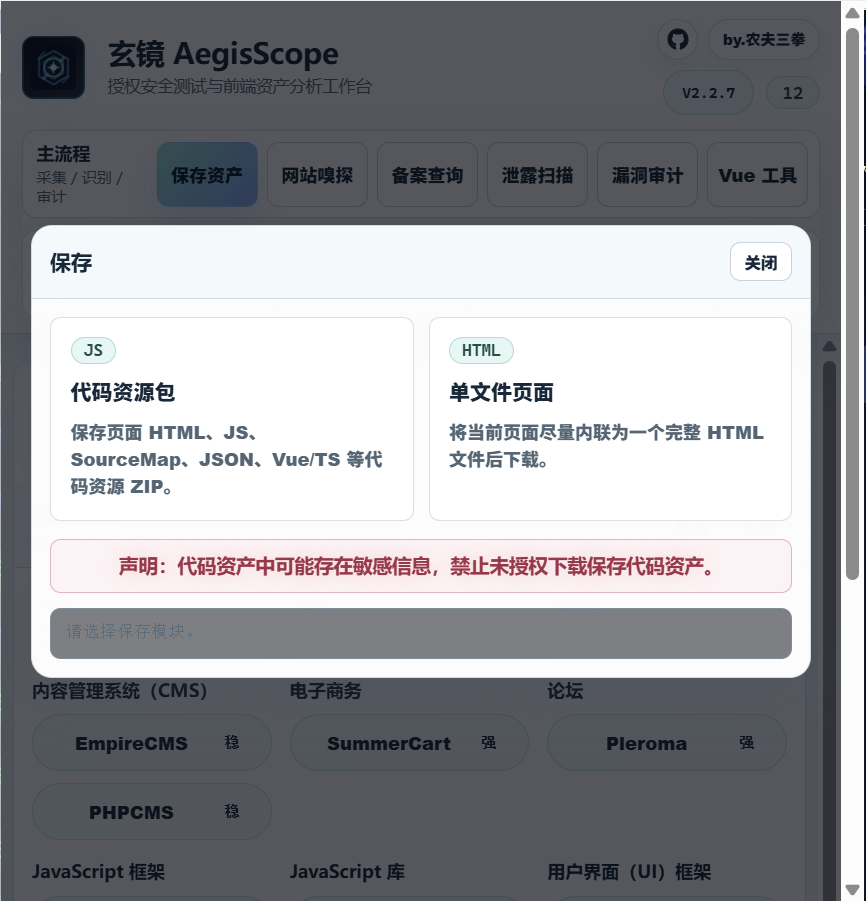

### 网站备案查询

网站备案查询模块用于在当前插件页面内快速提取目标站点备案线索。点击主弹窗中的“备案查询”后，插件会自动识别当前目标域名，并从当前页面正文、页面源码和链接中提取 ICP 备案号、公安备案号、许可证线索和备案相关链接。

模块会并发请求多个免费备案查询接口作为辅助数据源，尽量补充页面中没有直接展示的备案主体、备案号、网站名称和审核时间。当前保留 UAPI、远梦API、创信API、接口盒子、小尘API 等候选源；接口失败、限流、空响应或返回错误结果时会自动容错，不会阻塞页面本地备案线索展示。免费接口可能存在限流、缓存、跨域、失效或数据延迟，官方备案结果仍以工信部备案管理系统为准；如官方查询要求验证码，请在官方页面中完成复核。

模块支持手动填写查询域名、复制备案摘要、导出 JSON 结果，并提供工信部备案管理系统官方入口。为减少重复请求和接口限流，同一域名的免费接口结果会缓存 1 天，关闭并重新打开插件后仍可直接复用缓存结果；多个接口返回结果时会展示“多源一致”“单源命中”或“结果不一致”，便于判断是否需要官方复核。备案线索会分为“接口备案结果”和“页面提取线索”，接口结果会单独展示备案号、主办单位、单位性质、网站名称、审核时间和来源接口。

V2.2.2 优化了免费接口查询体验：接口会按返回顺序逐步展示结果，不再等待所有免费接口全部结束后才更新页面；单个接口最长等待 10 秒，避免慢接口长期阻塞备案结果展示。

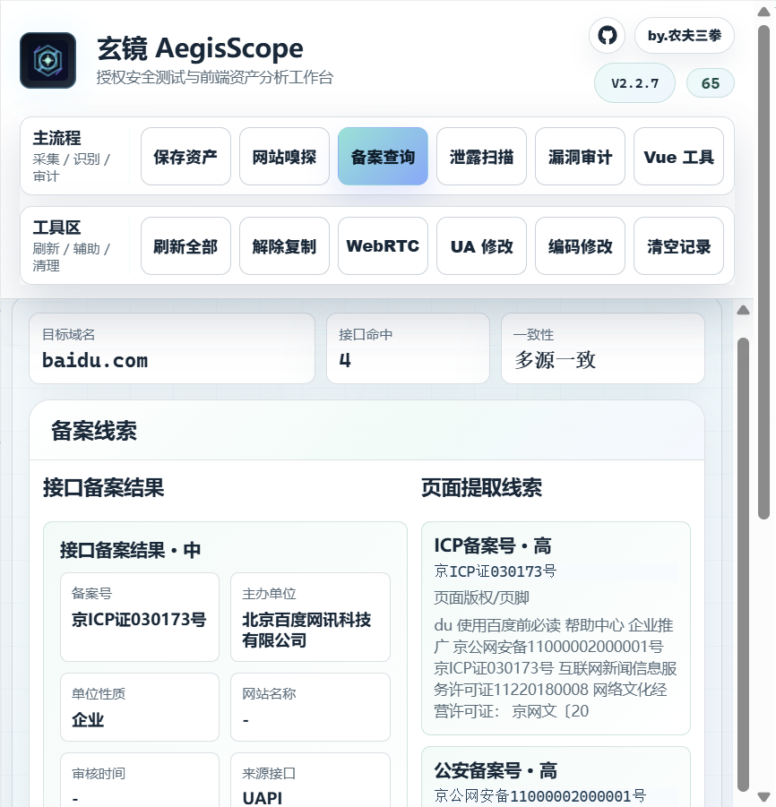

### 网站嗅探

网站嗅探模块采用玄镜自研的多来源识别思路，用于对当前站点进行被动技术识别。点击主弹窗中的“网站嗅探”后，结果会直接在当前插件页面内展开，不会跳转到新的页面。模块会结合页面 HTML、响应头、Cookie、Meta、脚本资源、运行时全局变量和资源路径等多类证据，快速识别 Web Server、运行时、前后端框架、CMS、JavaScript 库、UI 框架、字体脚本、数据库线索、分析工具、CDN、安全响应头、营销组件、页面构建器、支付组件、客服组件和监控组件等信息。

识别结果会按技术分类展示技术名、版本和命中证据，便于人工复核，避免只依赖单个关键词造成误报。V2.1.4 新增扩展嗅探规则库，并在原有规则基础上增加多来源评分、依赖规则、互斥规则和运行时全局变量链识别；识别到 jQuery 后，会显示“jQuery低版本漏洞验证”入口，并将嗅探到的目标 jQuery 链接传入验证页面。

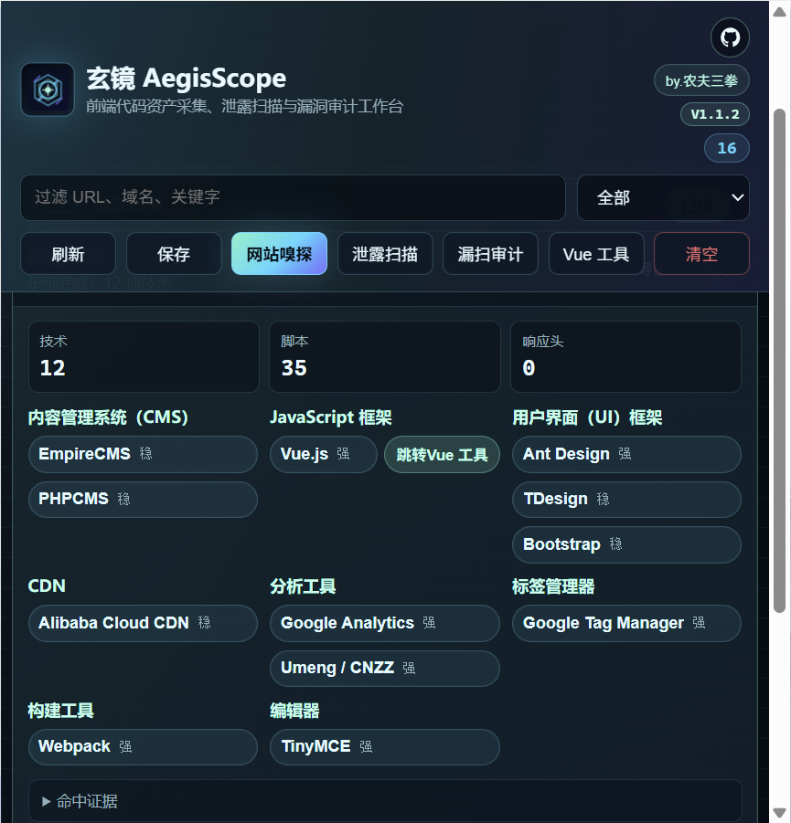

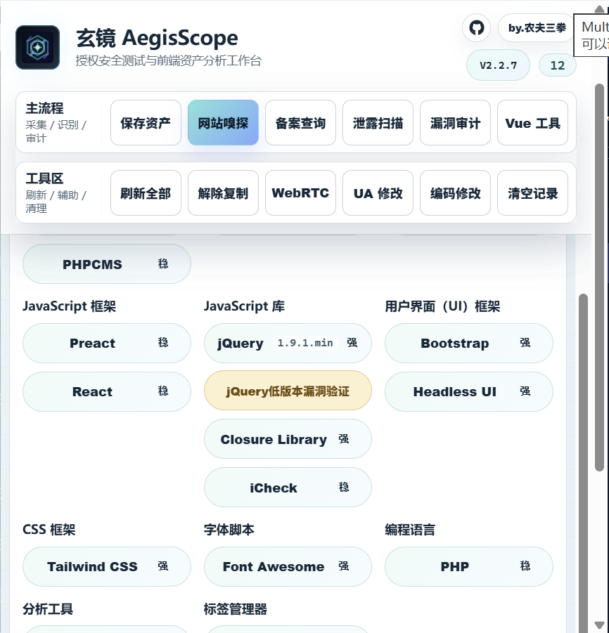

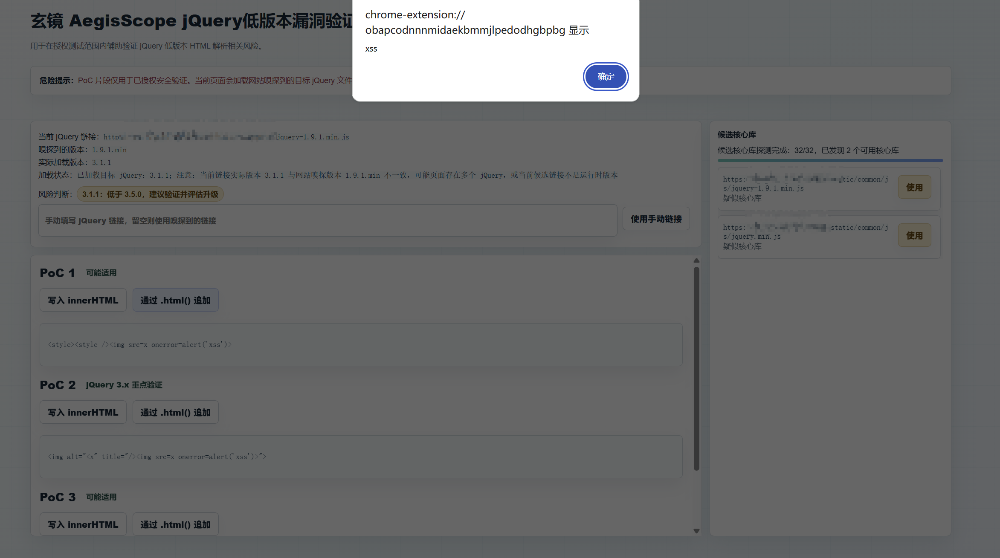

### 指纹扫描

指纹扫描模块位于网站嗅探页面中，用于对当前站点进行主动指纹识别。点击网站嗅探结果上方的“指纹扫描”后，会跳转到独立扫描页面并自动开始扫描，无需再次手动点击开始。

模块会结合首页响应、响应头、标题、Body 关键特征、图标 Hash、静态资源、常见产品路径和多证据评分进行识别，并对登录页、通用标题、弱关键词和错误页面进行降噪处理，减少把普通页面误判为具体产品的情况。当前指纹规则库包含 1.1 万余个产品指纹和 2.2 万余个匹配器；扫描结果会展示命中的产品、分类、置信度、状态码、响应长度、标题和关键证据，便于人工复核。

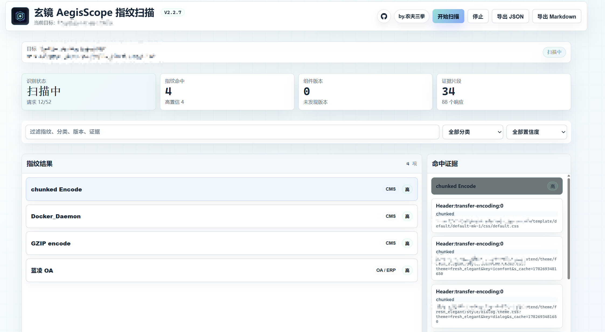

### 泄露扫描

泄露扫描用于发现前端代码中可能暴露的敏感数据、密钥、令牌和不安全加密用法。

支持识别的常见类型包括：

- 云厂商凭证：AWS、阿里云、腾讯云、Google Cloud、Azure、华为 OBS/OSS 等。
- 平台 Token：GitHub、GitLab、Slack、Discord、npm、Docker、Shopify、Cloudflare、Vercel、Netlify、Mailgun、Firebase 等。
- API Key 与请求头凭证：Bearer Token、Basic Auth、Authorization Token、X-API-Key、Session/Cookie Token 等。
- 个人敏感信息：邮箱、手机号、国际手机号、身份证号、银行卡号、公网 IP、内网 IP 等。
- Webhook：Slack、Discord、企业微信、钉钉、飞书等。
- 加密风险：硬编码 AES/IV/HMAC/JWT 密钥、AES ECB、DES/3DES、RC4、MD5/SHA1 安全上下文、RSA PKCS1/NoPadding、eval 解码执行等。
- 打包/混淆识别：Webpack、Vite/Rollup、Parcel、Browserify、Next.js、Nuxt、Angular、Umi/Dva，以及常见混淆和压缩特征。

扫描结果会按漏洞严重性排序，危害最高的结果优先展示。
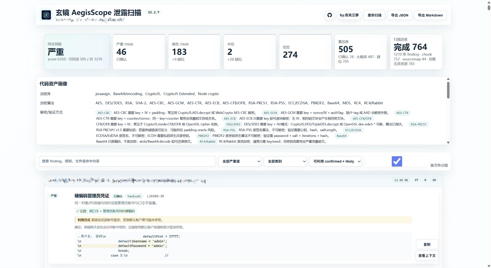

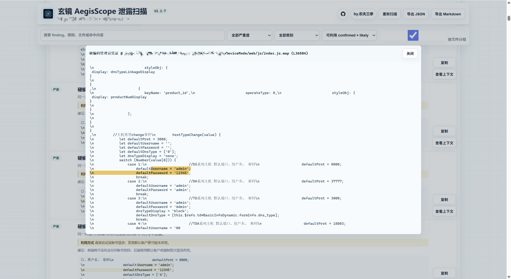

### 漏洞审计

漏洞审计模块用于从前端源码和接口线索中提取潜在业务风险，并辅助进行授权验证。

主要审计方向：

- 未授权 API、敏感 API、鉴权状态异常。
- 接口文档、OpenAPI、Swagger、Knife4j、GraphQL、GraphiQL 暴露。
- 前端路由鉴权依赖客户端状态。
- IDOR、租户/角色/归属字段可控。
- 支付、订单、金额、优惠、余额等逻辑参数风险。
- DOM XSS 数据流。
- 重定向、外部 URL、SSRF 参数风险。
- 上传校验依赖前端。
- CSRF、跨站凭证、CORS 配置风险。

可自动验证的发现会显示“验证”按钮，例如：

- 同源接口匿名探测。
- 接口文档入口探测。
- 前端路由守卫绕过尝试。

需要业务上下文的发现会显示“人工复核”说明，不再显示误导性的验证按钮，例如：

- IDOR/越权。
- 支付金额篡改。
- 上传绕过。
- DOM XSS。
- CSRF。
- 租户/角色字段可控。

每条漏洞发现都会尽量展示：

- 触发漏洞的文件。
- 命中的代码片段。
- 证据说明。
- 复核或修复建议。

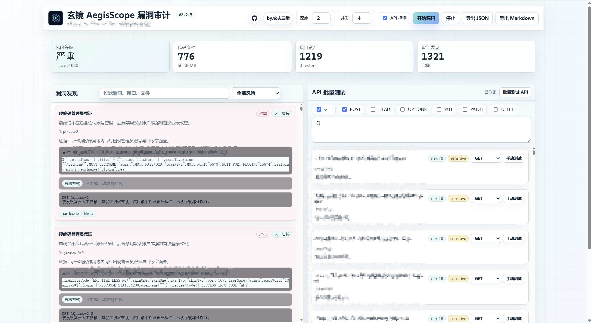

### API 批量测试

漏洞审计模块内置 API 批量测试能力：

- 支持 GET、POST、HEAD、OPTIONS、PUT、PATCH、DELETE。
- 支持自定义请求体。
- 同时测试带登录态请求和匿名请求。
- 支持响应状态码、响应类型、响应预览。
- 自动将高风险 API 放在前面。
- 每条 API 支持单独手动测试并选择 HTTP 方法。

对于 POST、PUT、PATCH、DELETE 等可能触发业务变更的方法，插件会进行确认提示。请只在授权测试环境中使用。

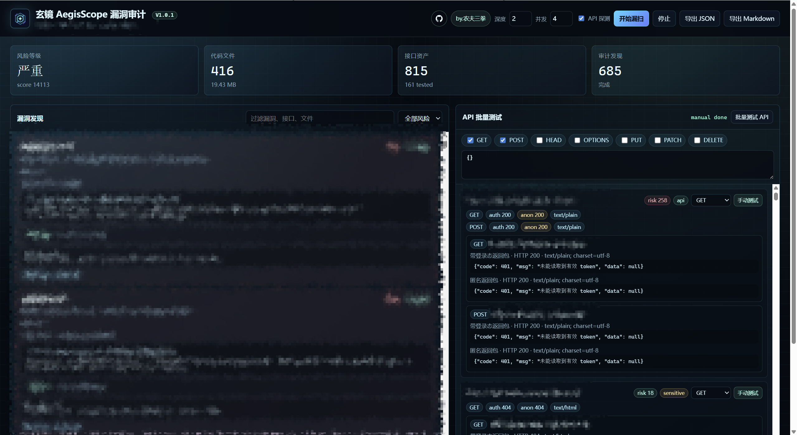

### Vue Router 运行时分析

Vue 工具模块用于分析当前页面中的 Vue / Vue Router 运行时实例。

主要能力：

- 识别 Vue 运行时、Router 实例、路由列表和守卫信息。
- 展示路由 path、name、meta、敏感路由标记。
- 支持点击路由直接跳转。
- 对前端路由鉴权类发现，可在验证时尝试清除路由守卫、修改鉴权 meta，并进入目标路由页面。
- 支持恢复已修改的路由守卫和 meta 状态。

说明：如果跳转后出现“登录失效，请重新登录”，通常说明服务端接口仍然校验登录态或会话状态。这种情况代表前端路由绕过不等于服务端鉴权绕过，需要继续复核接口返回状态。

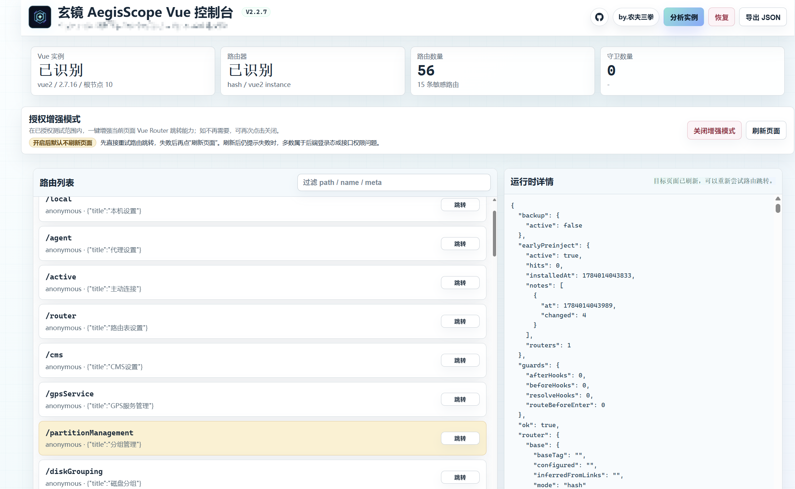

### 浏览器辅助

浏览器辅助模块位于主弹窗第二行功能区，当前版本已接入“解除复制”“WebRTC”和“UA 修改”三个能力。

解除复制用于在已授权页面中临时解除选择、复制、右键菜单、快捷键和粘贴拦截限制。模块支持当前页面启用、当前域名自动启用、增强模式、动态节点处理、Shadow DOM 处理、鼠标拖拽拦截处理，以及“复制当前选区”快捷操作。对于部分文库、在线文档、富文本阅读页和常见内容站点，插件会结合页面选区、编辑器选区、可见文本层和站点专项适配进行提取。

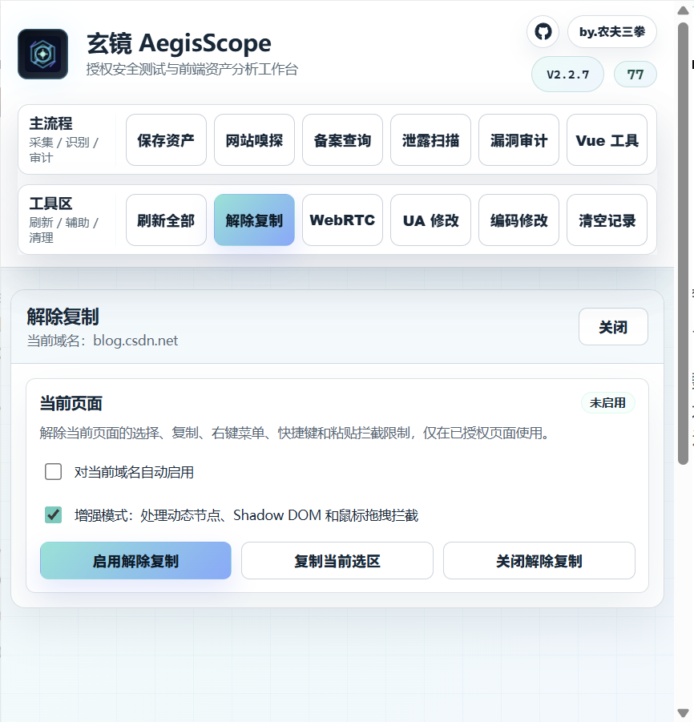

WebRTC 防泄漏用于降低浏览器通过 WebRTC 暴露本机网络地址的风险。模块优先使用浏览器官方 WebRTC 隐私策略，支持“禁用非代理 UDP”“仅公共接口”“公共与私有接口”和“浏览器默认”；未启用防护时，打开 WebRTC 面板会默认选中“强保护：禁用非代理 UDP”，点击“应用 WebRTC 策略”后才会生效。同时提供强阻断模式，可在页面上下文中禁用 `RTCPeerConnection`、`RTCSessionDescription`、`getUserMedia`、`mediaDevices`、`enumerateDevices`、`RTCDataChannel`、`RTCIceCandidate` 等对象。模块支持检测当前页 WebRTC 对象暴露情况，便于确认防护效果。强阻断可能影响视频会议、摄像头、语音通话、在线客服等依赖 WebRTC 的正常功能，请按需开启。

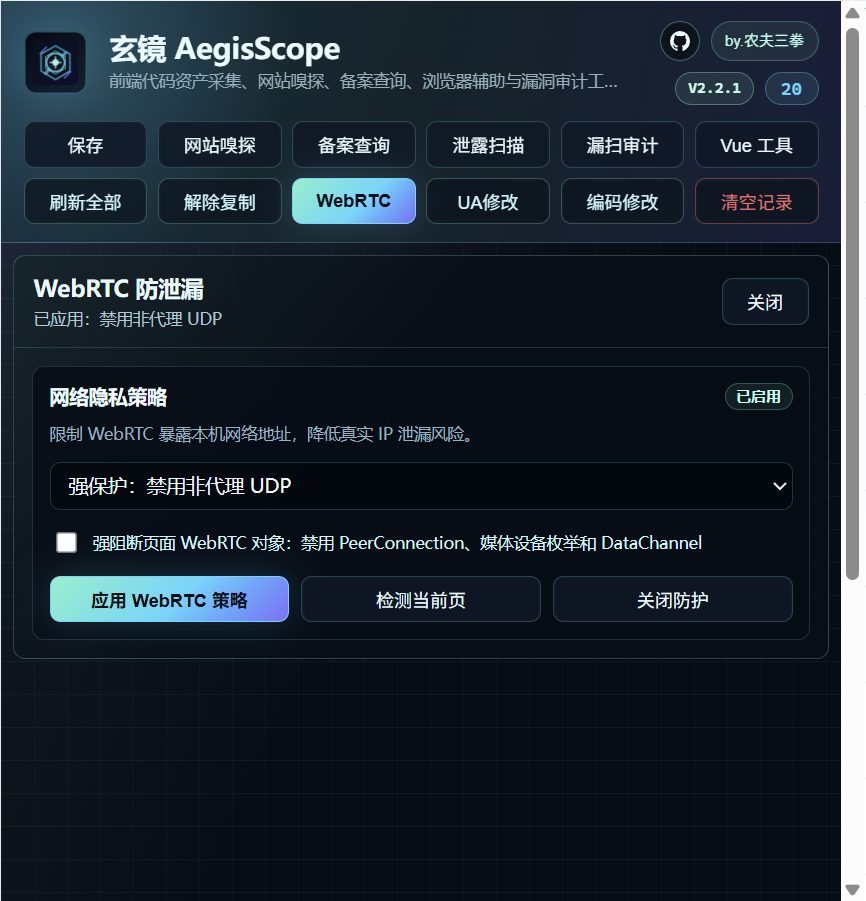

UA 修改用于在授权测试场景中快速切换当前页面的 User-Agent。模块支持按“桌面浏览器、移动浏览器、App / 桌面客户端、搜索爬虫、兼容旧版”分类选择 UA，内置 Chrome、Edge、Firefox、Safari、Android WebView、国产移动浏览器、微信内置浏览器、支付宝、钉钉、飞书、常见搜索爬虫等 66 个预设。应用范围支持“当前标签”“当前域名”和“全部页面”，并会同步修改请求头、Client Hints 和页面主环境中的 `navigator.userAgent`，可通过“检测 UA”确认当前页生效情况。

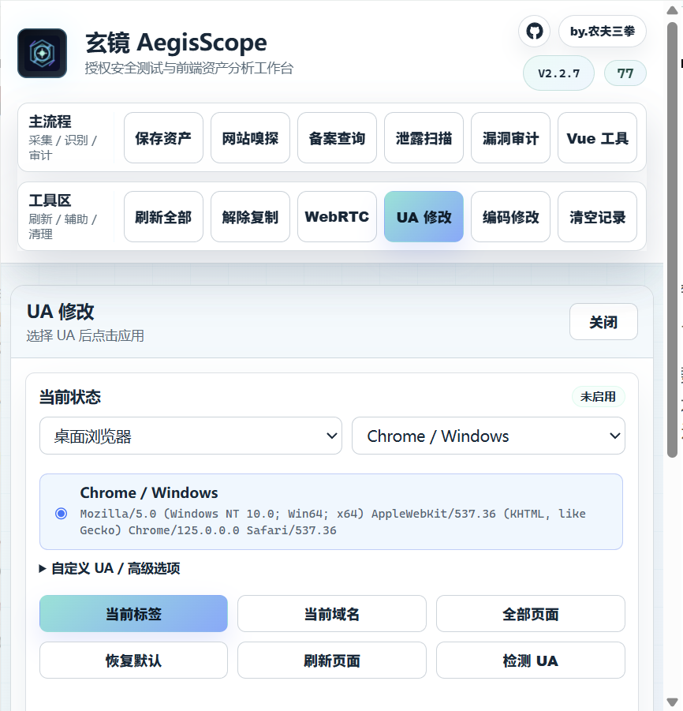

网站编码修改入口已在主弹窗中预留，当前显示“功能正在开发中”，后续版本会继续接入。

## 页面与模块

| 模块 | 文件 | 说明 |
| --- | --- | --- |
| 主弹窗 | `popup.html` | 代码资产列表、JS/HTML 保存、入口导航 |
| 解除复制 | `popup.html` / `copy-unlock.js` | 在授权页面解除选择、复制、右键菜单、快捷键和粘贴拦截限制 |
| WebRTC 防泄漏 | `popup.html` / `webrtc-guard.js` / `background.js` | WebRTC 隐私策略、页面强阻断和当前页暴露检测 |
| UA 修改 | `popup.html` / `background.js` / `ua-page.js` / `ua-isolated.js` | 按分类切换 User-Agent，支持当前标签、当前域名和全部页面应用 |
| 网站嗅探 | `popup.html` / `sniff-rules.js` | 主弹窗内嵌展示技术栈、CMS、框架、库、响应头与安全头识别 |
| 网站备案查询 | `popup.html` | 主弹窗内嵌展示当前页面 ICP 备案号、公安备案号、许可证线索和备案相关链接 |
| 指纹扫描 | `fingerprint-scan.html` / `fingerprint-rules.js` / `fingerprint-rules-extended.js` | 从网站嗅探入口进入，自动扫描站点产品指纹并展示命中证据 |
| jQuery 低版本验证 | `jquery-vuln-loader.html` / `jquery-vuln-check.html` | 从网站嗅探的 jQuery 结果进入，获取并加载嗅探到的目标 jQuery 链接后展示 PoC 验证页面 |
| 泄露扫描 | `scan.html` | 敏感信息、密钥、加密风险、打包产物分析 |
| 漏洞审计 | `vuln-scan.html` | 源码审计、API 测试、漏洞验证 |
| Vue 控制台 | `vue-tools.html` | Vue Router 运行时分析与路由跳转 |
| 规则库 | `rules.js` | 泄露扫描与安全规则 |
| 分析器 | `analyzer.js` | 规则执行、去重、聚合与排序 |
| 嗅探规则 | `sniff-rules.js` / `sniff-rules-webtech.js` | 网站技术指纹规则与扩展被动识别规则 |
| 后台采集 | `background.js` | 网络脚本资源、响应头与站点资源记录 |
| 内容脚本 | `content.js` | 页面脚本资产采集 |

## 安装方式

### Chrome / Edge 加载未打包扩展

1. 解压 `玄镜 AegisScope_V2.2.3.zip`。
2. 打开浏览器扩展管理页面：
   - Chrome：`chrome://extensions`
   - Edge：`edge://extensions`
3. 开启“开发者模式”。
4. 点击“加载已解压的扩展程序”。
5. 选择解压后的扩展目录。
6. 在目标页面打开插件图标，即可开始使用。

## 快速使用

### 采集与保存

1. 打开目标页面。
2. 点击浏览器工具栏中的玄镜图标。
3. 点击“刷新全部”重新采集当前页面代码资产。
4. 点击“保存”，选择 `JS` 可生成包含页面 HTML、脚本、SourceMap 和相关代码资源的 ZIP。
5. 点击“保存”，选择 `HTML` 可将当前页面尽量保存为单个 HTML 文件。

### 网站备案查询

1. 打开目标页面。
2. 点击主弹窗中的“备案查询”。
3. 查看自动识别的目标域名、ICP备案号、公安备案号、许可证线索、免费接口查询结果和备案相关链接。
4. 如需人工复核，可点击“官方入口”打开工信部备案管理系统。
5. 可复制备案摘要或导出 JSON 结果。

### 网站嗅探

1. 打开目标页面。
2. 点击主弹窗中的“网站嗅探”。
3. 在当前插件页面内查看按分类展示的技术栈、版本、站点画像和响应头。
4. 根据每条结果中的命中证据和置信度进行人工复核。
5. 如识别到 jQuery，可点击“jQuery低版本漏洞验证”进入验证页面。
6. 可导出 JSON 报告。

### 指纹扫描

1. 打开目标页面。
2. 点击主弹窗中的“网站嗅探”。
3. 点击网站嗅探结果上方的“指纹扫描”。
4. 插件会跳转到指纹扫描页面并自动开始扫描。
5. 查看产品指纹、分类、置信度、状态码、响应长度、页面标题和命中证据。

### 泄露扫描

1. 打开目标页面。
2. 点击主弹窗中的“泄露扫描”。
3. 等待扫描完成。
4. 根据严重性优先查看结果。
5. 可按严重性、分类、置信度或关键字过滤。
6. 可导出 JSON 或 Markdown 报告。

### 漏洞审计

1. 点击主弹窗中的“漏扫审计”。
2. 配置递归深度和并发数。
3. 可开启或关闭 API 探测。
4. 查看“漏洞发现”和“API 批量测试”结果。
5. 对支持自动验证的发现点击“验证”。
6. 对人工复核类发现，根据代码片段和复核建议进行测试。

### Vue 控制台

1. 点击主弹窗中的“Vue 工具”。
2. 点击“分析实例”。
3. 查看路由列表和运行时详情。
4. 点击路由项中的跳转按钮进入对应页面。
5. 如曾修改守卫或 meta，可点击“恢复”。

### 浏览器辅助

#### 解除复制

1. 打开已授权测试页面。
2. 点击主弹窗第二行中的“解除复制”。
3. 按需勾选“对当前域名自动启用”和“增强模式”。
4. 点击“启用解除复制”。
5. 如需直接复制页面选区，可先在目标页面选中文本，再点击“复制当前选区”。

#### WebRTC 防泄漏

1. 点击主弹窗第二行中的“WebRTC”。
2. 默认会选中“强保护：禁用非代理 UDP”，也可以按需切换其他 WebRTC 隐私策略。
3. 如需要页面级阻断，可勾选“强阻断页面 WebRTC 对象”。
4. 点击“应用 WebRTC 策略”。
5. 点击“检测当前页”可查看当前页面 WebRTC 对象是否仍然暴露。

说明：开启或关闭强阻断后，已打开的目标页面建议刷新一次，以确保页面上下文中的 WebRTC 对象按最新状态生效。

#### UA 修改

1. 点击主弹窗第二行中的“UA 修改”。
2. 在第一个下拉框选择分类，例如“桌面浏览器”“移动浏览器”或“App / 桌面客户端”。
3. 在第二个下拉框选择具体 UA，下面会展示当前选中 UA 的完整内容。
4. 点击“当前标签”“当前域名”或“全部页面”选择应用范围。
5. 页面刷新后，可点击“检测 UA”查看页面主环境中的 `navigator.userAgent` 是否已切换。

说明：UA 修改会影响目标站点对浏览器、系统、App 内置环境或爬虫环境的识别结果。请仅在授权测试、兼容性验证或调试场景中使用；部分站点仍可能结合 IP、Cookie、JS 指纹、Client Hints、登录态或服务端风控判断真实环境。

## 支持的数据与风险类型

### 泄露类

| 类型 | 示例 |
| --- | --- |
| 云密钥 | AWS、阿里云、腾讯云、GCP、Azure、华为 OBS/OSS |
| 平台 Token | GitHub、GitLab、Slack、Discord、npm、Docker、Cloudflare、Shopify |
| 认证信息 | Bearer、Basic Auth、Authorization Token、Session/Cookie |
| Webhook | Slack、Discord、企业微信、钉钉、飞书 |
| 个人信息 | 邮箱、手机号、国际手机号、身份证号、银行卡、公网/内网 IP |
| 加密风险 | 硬编码密钥、弱算法、不安全模式、解码后执行 |

### 审计类

| 类型 | 说明 |
| --- | --- |
| 未授权接口 | 匿名请求可访问敏感接口 |
| 鉴权异常 | 带登录态与匿名请求返回状态不一致 |
| 接口文档暴露 | Swagger/OpenAPI/GraphQL 调试入口 |
| 客户端鉴权 | 路由守卫或 meta 依赖前端状态 |
| 逻辑风险 | 支付、订单、角色、租户、归属字段可控 |
| XSS/跳转/上传 | DOM XSS、开放重定向、上传校验依赖前端 |
| CSRF/CORS | 跨站凭证、CSRF 配置、CORS 宽松配置 |

## 报告导出

泄露扫描支持：

- JSON 报告。
- Markdown 报告。
- 结果按严重性排序。
- 包含来源文件、命中位置、证据、建议和上下文。

漏洞审计支持：

- JSON 报告。
- Markdown 报告。
- 漏洞发现、验证结果、PoC 或人工复核建议。
- API 测试状态和响应预览。
- 文件来源和代码片段追踪。

网站嗅探、备案查询和指纹扫描支持：

- JSON 报告。
- 指纹扫描支持 Markdown 报告。
- 包含技术栈、备案线索、产品指纹、置信度、版本和命中证据。

## 权限说明

玄镜 AegisScope 使用以下浏览器权限：

| 权限 | 用途 |
| --- | --- |
| `activeTab` | 获取当前活动标签页信息 |
| `scripting` | 在当前页面执行采集、备案线索提取、Vue 分析和路由验证脚本 |
| `downloads` | 下载 ZIP、HTML、JSON、Markdown 报告 |
| `storage` | 保留基础状态、功能配置、缓存和自动启用站点 |
| `clipboardWrite` | 支持解除复制模块中的当前选区复制 |
| `webRequest` | 记录页面加载的脚本资源、响应头与网站嗅探证据 |
| `privacy` | 设置浏览器 WebRTC 隐私策略，降低真实 IP 泄漏风险 |
| `declarativeNetRequest` | 修改 UA 请求头和 Client Hints，用于 UA 修改模块 |
| `<all_urls>` | 支持对不同站点进行授权测试 |

## 安全与合规说明

本工具仅用于：

- 自有系统安全检查。
- 已授权的渗透测试。
- SRC 或企业内部安全审计。
- 前端打包产物分析与风险梳理。

请勿在未授权的网站上进行网站嗅探、备案查询、主动指纹扫描、接口探测、批量测试、漏洞验证或业务变更类请求。对于可能改变业务状态的 HTTP 方法，例如 POST、PUT、PATCH、DELETE，请只在测试环境或明确授权范围内执行。

## 常见问题

### 为什么有些漏洞没有“验证”按钮？

部分漏洞需要真实业务上下文，例如两个不同账号、订单状态、租户数据、上传存储路径或后端处理结果。插件无法安全地自动构造这些条件，因此会显示“人工复核”和复核建议。

### 为什么路由绕过后仍提示登录失效？

这通常说明服务端接口仍然校验登录态。前端路由守卫被绕过后，只能进入页面外壳；如果接口返回 401/403，说明服务端鉴权仍然有效。

### 为什么有些脚本无法获取？

可能原因包括：

- CORS 限制。
- 脚本需要特殊 Cookie 或签名。
- 资源已过期或返回 404。
- 页面使用 blob/data 动态构造脚本。
- 浏览器扩展权限无法访问受保护页面。

### 保存模块会下载图片和 CSS 吗？

JS 资源 ZIP 会跳过 CSS、图片、字体、音视频等非代码资源，重点采集 HTML、JavaScript、SourceMap、JSON、Vue/Svelte/TS 等代码类资源。

HTML 单文件保存会尽量内联当前页面可访问的 CSS、图片、图标、脚本和响应式图片资源；受 CORS、登录态或资源大小限制无法获取的资源会保留原始外链。

## 版本记录

### V2.2.3

- 基于 V2.2.2 的主弹窗性能与代码整理版本。
- 合并 UA 修改入口的重复点击监听，保持原有 UA 选择、应用范围、检测和恢复默认功能不变。
- 网站嗅探扩展规则改为打开插件后自动延后加载，不再随主弹窗 HTML 同步阻塞解析；网站嗅探仍保持插件打开后默认自动运行。
- WebRTC 面板在未启用防护时默认选中“强保护：禁用非代理 UDP”，点击应用后才会写入浏览器隐私策略；已启用的历史策略不会被自动覆盖。

### V2.2.2

- 基于 V2.2.1 的 UA 修改功能实装版本。
- 新增 UA 修改模块，支持按“桌面浏览器、移动浏览器、App / 桌面客户端、搜索爬虫、兼容旧版”分类选择 User-Agent。
- 内置 66 个 UA 预设，覆盖常见桌面浏览器、移动浏览器、Android WebView、微信内置浏览器、支付宝、钉钉、飞书、国产移动浏览器和搜索爬虫。
- UA 修改支持“当前标签”“当前域名”“全部页面”三种应用范围，并支持恢复默认、刷新页面和检测当前页 UA。
- UA 修改会同步处理请求头、Client Hints 和页面主环境中的 `navigator.userAgent`，检测按钮读取页面主环境结果，便于确认是否生效。
- 针对微信内置浏览器新增专项预设，覆盖 Windows 普通链接、Windows 小程序环境、macOS、iPhone、iPad、Android XWeb 和 Android 小程序进程等常见场景。
- 优化备案查询免费接口响应体验，接口结果会逐步返回并实时更新展示，单接口最长等待 10 秒，避免慢接口阻塞整体备案结果。
- 本版本新增 `declarativeNetRequest` 权限，更新或重新加载 V2.2.2 后，请在浏览器扩展管理页重新加载插件，以确保权限和后台服务正常生效。
- 网站编码修改入口继续保留为开发中占位，后续版本继续接入。

### V2.2.1

- 基于 V2.1.5 的浏览器辅助功能升级版本。
- 主弹窗第二行新增浏览器辅助入口，已接入“解除复制”和“WebRTC”两个功能。
- 新增解除复制模块，支持解除当前授权页面的选择、复制、右键菜单、快捷键、粘贴和拖拽拦截限制。
- 解除复制支持当前域名自动启用、增强模式、动态节点处理、Shadow DOM 处理、复制当前选区和常见文库/在线文档/内容站点专项适配。
- 新增 WebRTC 防泄漏模块，支持浏览器官方 WebRTC 隐私策略，可选择禁用非代理 UDP、仅公共接口、公共与私有接口或恢复浏览器默认。
- WebRTC 防泄漏新增强阻断模式，可在页面上下文中禁用 WebRTC 相关对象，并支持当前页 WebRTC 暴露面检测。
- 本版本新增 `clipboardWrite` 和 `privacy` 权限，更新或重新加载 V2.2.1 后，请在浏览器扩展管理页重新加载插件，以确保权限和后台服务正常生效。
- UA 修改和网站编码修改入口已预留，当前显示“功能正在开发中”，后续版本继续接入。

### V2.1.5

- 基于 V2.1.4 的主弹窗交互优化版本。
- 将主弹窗“刷新”调整为“刷新全部”，会重新采集当前页面代码资产、绕过当前视图的网站嗅探/备案查询缓存重新查询，并重新检查 GitHub 最新版本。
- 将主弹窗“清空”调整为“清空记录”，会清空当前标签页的代码资源列表、网站嗅探结果、备案查询当前结果、网站嗅探内存缓存以及后台脚本/响应头/资源观测记录。
- 清空记录不会清除使用许可同意状态、GitHub 更新检查缓存、备案接口 1 天缓存、已下载文件或浏览器自身缓存。
- 指纹扫描、泄露扫描、漏洞审计、Vue 工具等独立页面保持原有工作方式。
- 优化备案查询接口候选源，移除不可用的 ICP API Plus 候选源；小尘API 当前复测可返回备案数据，并增强多节点 JSON 返回解析，避免接口同时返回 `data` 与 `icp` 节点时漏掉备案号、主体、单位性质和审核时间。

### V2.1.4

- 基于 V2.1.3 的网站嗅探增强版本。
- 新增 `sniff-rules-webtech.js` 扩展嗅探规则库，在不覆盖原有网站嗅探规则的前提下追加 7010 个被动技术识别规则。
- 扩展运行时全局变量链，新增 5503 条运行时探测链，用于提升前端框架、JavaScript 库、分析工具、支付组件、客服组件和页面构建器的识别覆盖面。
- 网站嗅探新增 requires/excludes 约束处理，弱证据规则需要更高置信度或多证据组合命中，减少单个通用关键词造成的误报。
- 新增网站嗅探规则预索引、来源预过滤和 hint 预过滤，降低大规则库下的无效正则匹配，提高低配电脑上的弹窗响应速度。
- 新增 10 分钟标签页级网站嗅探内存缓存，重复打开插件时会先显示最近一次结果，再后台刷新当前页面信号。
- 优化版本提取优先级，运行时、Meta、响应头和资源路径中的版本证据会优先参与最终版本展示。
- 优化命中强度说明，技术标签会根据运行时、响应头、Meta、Cookie、多证据组合或资源路径等证据类型标记命中可信度。
- 优化 Cookie 证据匹配，大小写不同的 Cookie 名也可归一识别。
- 优化页面 CSS 规则采集性能，避免大样式表页面产生不必要的重复字符串拼接。
- 系统性补齐“全局变量存在即命中”和复杂 DOM 选择器命中规则，减少前端框架、静态站点生成器、分析组件、客服组件和 CMS 插件类技术漏报。

### V2.1.3

- 基于 V2.1.2 的指纹扫描修复和优化版本。
- 基于 body/header/title/faviconhash 等多来源匹配思路，批量融合 EHole 指纹规则库。
- 新增 `fingerprint-rules-extended.js` 扩展规则库，将约 2.5 万条原始规则聚合为 1.1 万余个产品指纹和 2.2 万余个匹配器。
- 扩展规则按产品聚合并区分 favicon、header、title、body 证据强度；弱证据需要多证据组合命中，强证据才允许单点高置信命中，以提高识别覆盖面并减少误报。
- 增强指纹扫描候选请求，页面已有 script/link 资源和高价值 OA 登录/资源路径会进入扫描队列。
- 优化扩展指纹库扫描性能，限制后台观察资源采样、分批执行规则分析、规则片段让出主线程、缓存大文本匹配结果，并在关闭指纹扫描页时立即停止请求和释放扫描结果，降低低配电脑卡顿和主弹窗再次打开受影响的概率。
- 扩展规则新增弱单证据过滤和重复响应去重，减少通用登录页、短关键词、重复资源造成的误报与重复计算。

### V2.1.2

- 基于 V2.1.1 的 UI 优化版本。
- 主弹窗顶部去除代码资产过滤输入框和类型下拉框，默认直接展示当前页面采集到的全部代码资产。
- 优化主弹窗顶部排版，调整 logo、标题、项目入口、作者、版本号和资产数量的层级与对齐。
- 优化主功能按钮状态，默认打开网站嗅探并高亮，点击其它功能后动态切换当前功能高亮。
- 优化备案查询页面提取线索，新增对 footer、版权区、底部备案区及相关链接的专项提取。
- 增强备案查询页面线索准确率，新增 Meta/Noscript、备案链接文本提取、备案号归一化、占位示例过滤和高可信来源优先去重。
- 新增版本更新提醒，顶部版本号会检查 GitHub 最新发布版本；发现新版本时显示红点，点击版本号可查看更新提示并跳转项目主页。

### V2.1.1

- 基于 V1.1.3 的功能升级和修复版本。
- 新增网站备案查询模块，结果直接在主弹窗内展示，不跳转独立页面。
- 支持自动识别当前目标域名，从页面正文、页面源码和链接中提取 ICP 备案号、公安备案号、许可证线索和备案相关链接。
- 支持并发调用 6 个免费备案查询候选源作为辅助数据源，接口失败不会阻塞页面本地线索展示。
- 新增备案查询 1 天持久缓存、多源一致性判断和接口健康状态展示。
- 优化备案线索展示，将接口备案结果独立为大卡片，页面提取线索单独分组展示。
- 支持手动填写查询域名、复制备案摘要、导出 JSON 结果，并提供工信部备案管理系统官方入口。

### V1.1.3

- 基于 V1.1.2 的功能升级和修复版本。
- 增强网站嗅探中的 jQuery 识别强度，增加运行时版本、脚本路径、资源路径和内联脚本证据。
- 网站嗅探识别到 jQuery 后，新增“jQuery低版本漏洞验证”入口。
- 新增 jQuery 低版本验证页面，打开时默认使用嗅探到的目标网站 jQuery 链接，也支持手动填写 jQuery 链接并优先使用手动链接验证。
- jQuery 低版本验证页面保留 PoC1、PoC2、PoC3、`Assign to innerHTML` 和 `Append via .html()` 交互。

### V1.1.2

- 基于 V1.0.1 的功能升级和修复版本。
- 新增网站嗅探模块，结果直接在主弹窗内展示，支持技术栈、CMS、框架、JavaScript 库、UI 框架、响应头、CDN 与安全头识别。
- 网站嗅探结果会按技术分类展示技术名、版本和命中证据，支持 JSON 导出。
- 网站嗅探增强多证据评分，新增 CSS、内联脚本、Class、Link、资源域名和运行时全局变量等信号，并对弱证据规则增加置信度门槛以减少误报。
- 新增指纹扫描入口和独立扫描页面，支持从网站嗅探页面进入后自动开始扫描，并展示产品指纹、置信度和命中证据。
- 保留 V1.0.1 的保存、泄露扫描、漏洞审计、API 批量测试和 Vue Router 运行时分析能力。

### V1.0.1

- 漏洞审计的漏洞发现验证结果增加对应请求方法的返回包回显。
- API 批量测试完成后，会回显所有勾选请求方法的返回包。

### V1.0.0

- 全新品牌：玄镜 AegisScope。
- 新增科技感扩展图标与统一 UI。
- 支持页面代码资产采集与 ZIP 打包下载。
- 支持泄露扫描、加密风险识别、打包器与混淆特征识别。
- 支持漏洞审计、API 批量测试、自动验证与人工复核建议。
- 支持 Vue Router 运行时分析、路由跳转与守卫绕过验证。
- 支持 JSON / Markdown 报告导出。

玄镜 AegisScope V2.2.3  
为授权前端安全测试、代码资产分析和漏洞审计而生。

## Star History

<a href="https://www.star-history.com/?repos=flagqaz%2FAegisScope&type=date&legend=top-left">
 <picture>
   <source media="(prefers-color-scheme: dark)" srcset="https://api.star-history.com/chart?repos=flagqaz/AegisScope&type=date&theme=dark&legend=top-left" />
   <source media="(prefers-color-scheme: light)" srcset="https://api.star-history.com/chart?repos=flagqaz/AegisScope&type=date&legend=top-left" />
   
 </picture>
</a>
